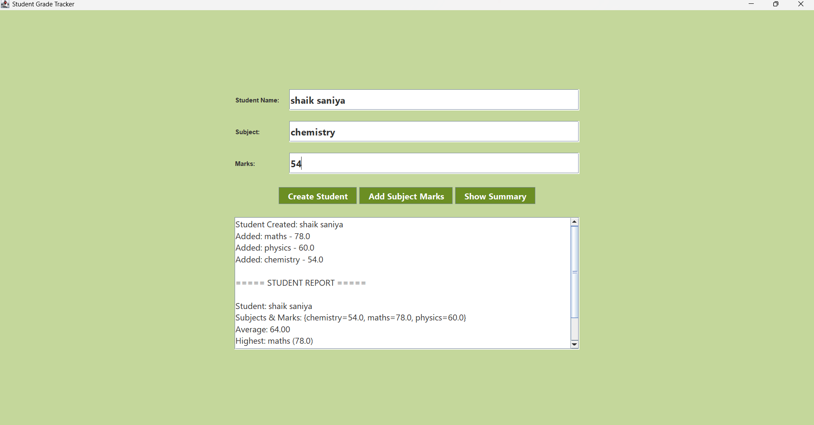

# 🎓 Student Grade Tracker

A Java Swing-based GUI application for managing student subject-wise marks and analyzing academic performance.

---

## 📌 Features

- Create student records
- Add subject-wise marks
- Calculate average marks
- Identify highest scoring subject
- Identify lowest scoring subject
- Professional olive-green GUI theme

---

## 🛠 Technologies Used

- Java
- Java Swing (GUI)
- OOP Concepts
- HashMap & ArrayList

---

## 📊 Application Screenshot

---

## 🚀 How to Run

1. Open project in any Java IDE.
2. Run `GradeTrackerUI.java`
3. Enter student details and subject marks.
4. Click **Show Summary** to view report.

---

## 📚 Project Type

CodeAlpha Internship Task 1  
Student Grade Tracker

---

## 👩‍💻 Author

Shaik Saniya
